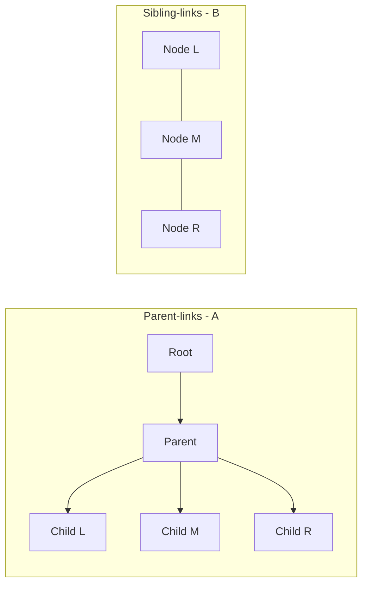
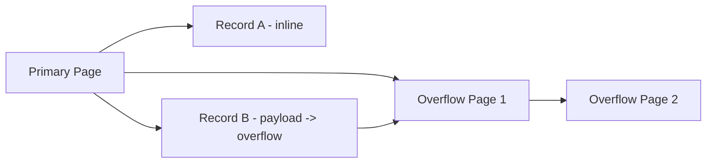
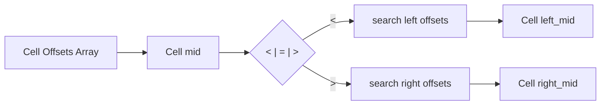
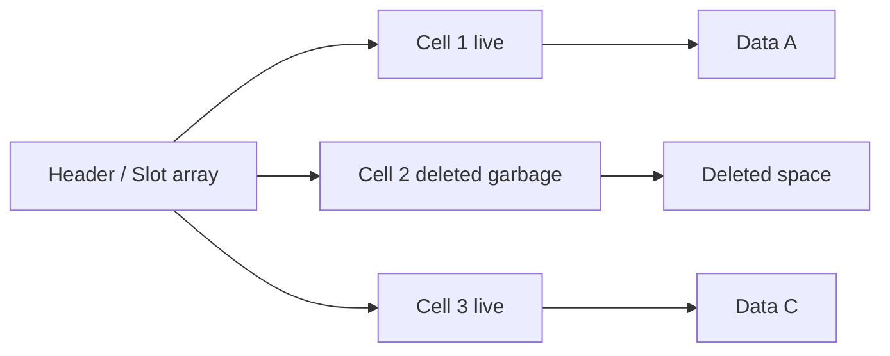

# Database Internals

> O'Reilly Alex Petrov

---

## Chapter 4 — Implementing BTrees (한글 정리)

4장: B-Tree 구현

지난 장에서는 이진 바이너리 포맷 구성의 일반 원칙을 다루었고, 셀을 생성하고 계층 구조를 구축하며 포인터로 페이지에 연결하는 방법을 학습했습니다. 이러한 개념은 인플레이스 업데이트 방식과 append-only 방식 모두에 적용됩니다. 이 장에서는 디스크 기반 B-Tree 구현에 특화된 몇몇 개념을 다룹니다.

이 장의 구성은 세 가지 논리적 그룹으로 나뉩니다. 첫째, 조직화(organization)를 다루며: 키와 포인터 간의 관계를 어떻게 수립하는지, 그리고 페이지 헤더와 페이지 간 링크를 어떻게 구현하는지를 설명합니다.

다음으로 루트에서 리프까지 내려가는 과정에서 발생하는 처리, 즉 페이지 내부에서 이진 탐색을 수행하는 방법과 분할/병합이 발생할 경우를 대비해 breadcrumbs(경로 스택)를 수집하고 부모 노드를 추적하는 방법을 다룹니다.

마지막으로 재균형(rebalancing), 우측 전용 append 최적화, 대량 로딩(bulk loading) 같은 최적화 기법과 유지보수 프로세스 및 가비지 수집을 논의합니다.

---

페이지 헤더

페이지 헤더는 네비게이션, 유지보수, 최적화에 사용되는 페이지 관련 정보를 담습니다. 일반적으로 페이지 내용과 레이아웃을 설명하는 플래그, 페이지 내 셀 수, 빈 공간을 표시하는 lower/upper 오프셋(셀 오프셋과 데이터를 덧붙이는 데 사용), 그리고 기타 유용한 메타데이터를 포함합니다.

예를 들어 PostgreSQL은 헤더에 페이지 크기와 레이아웃 버전을 저장합니다. MySQL InnoDB의 페이지 헤더는 힙 레코드 수, 레벨 및 기타 구현 특화 값을 담고 있습니다. SQLite에서는 페이지 헤더에 셀 수와 오른쪽 포인터(rightmost pointer)를 저장합니다.

매직 넘버

파일이나 페이지 헤더에 자주 넣는 값 중 하나가 매직 넘버입니다. 보통 다중 바이트 블록으로 구성되며, 해당 블록이 페이지를 나타낸다는 것을 신호하거나 페이지 종류 또는 버전을 식별하는 데 사용되는 상수 값을 담고 있습니다.

매직 넘버는 유효성 검사와 무결성 체크에 자주 사용됩니다. 임의의 오프셋에서 읽은 바이트 시퀀스가 정확히 매직 넘버와 일치할 확률은 매우 낮습니다. 일치한다면 그 오프셋이 올바를 가능성이 큽니다. 일례로 페이지가 올바르게 로드되고 정렬되었는지 확인하기 위해 쓰기 시 헤더에 특정 매직 넘버를 넣고, 읽을 때는 헤더에서 읽은 바이트를 기대 시퀀스와 비교하여 페이지를 검증합니다.

형제 링크

일부 구현에서는 좌우 형제 페이지를 가리키는 전/후방 링크를 저장합니다. 이러한 링크는 부모로 올라가지 않고도 인접 노드를 찾는 데 도움이 됩니다. 다만 이러한 방식은 분할/병합 연산 시 형제의 오프셋을 업데이트해야 하므로 복잡성을 증가시킵니다. 예를 들어 오른쪽 끝이 아닌 노드가 분할되면, 그 노드의 오른쪽 형제의 backward 포인터를 새로 생성된 노드를 가리키도록 재연결해야 합니다.

오른쪽 포인터

B-Tree의 분리자 키는 서브트리로 분할하고 탐색하는 데 사용되므로 키 수보다 자식 포인터 수가 항상 하나 더 많습니다. 이 추가 포인터는 헤더에 저장되거나(예: SQLite) 셀과 짝지어 보관될 수 있습니다(예: PostgreSQL의 high-key 방식).

오버플로 페이지

노드 크기와 트리의 fanout 값은 고정된 경우가 많습니다. 가변 길이 값을 다룰 때, 페이로드가 페이지 크기를 초과하면 오버플로 페이지를 할당해 연결함으로써 연속적 메모리 복사를 피합니다. 기본 페이지(Primary)에서 추가 페이지(Overflow)를 링크하여 페이로드를 연장하는 방식입니다.

이진 탐색

페이지 내부에서 키는 논리적 정렬을 유지하도록 오프셋 배열로 관리됩니다. 이진 탐색은 오프셋 배열의 중간 오프셋을 선택하고 해당 셀을 읽어 비교하는 방식으로 수행됩니다. 페이지 내 비교는 메모리에서 하는 것보다 디스크 I/O를 줄이는 방향으로 설계되어야 합니다.

브레드크럼(BTStack)

분할이나 병합이 상향으로 전파될 가능성이 있을 때, 루트에서 리프까지 내려갈 때 방문한 노드와 인덱스를 스택(브레드크럼)에 기록해 두고 역순으로 탐색하여 부모를 찾아 처리합니다. PostgreSQL은 내부적으로 BTStack이라는 구조로 이 정보를 관리합니다.

리밸런싱 및 최적화

일부 구현체는 분할과 병합을 연기하고 같은 레벨 내에서 요소를 이동시켜 노드 점유율을 개선합니다. B*-Tree 계열은 이웃 노드들 간의 재분배를 통해 평균 점유율을 높입니다. 또한 오른쪽 전용 append나 bulk loading 같은 최적화 기법으로 쓰기 비용을 낮출 수 있습니다.

압축과 블록 패딩

페이지 단위 압축은 개별 페이지를 독립적으로 압축하고 해제할 수 있게 해 읽기 시 필요한 페이지만 처리하도록 합니다. 다만 압축된 페이지가 디스크 블록보다 작을 때 블록 단위 전송으로 인한 추가 로드가 발생할 수 있습니다.

유지보수: Vacuum / Compaction

삭제와 업데이트로 인해 페이지에 논리적 여유 공간은 있어도 연속적 물리 공간이 없어질 수 있습니다. 이를 해결하기 위해 비동기적인 compaction/vacuum 프로세스가 필요하며, 이는 죽은 셀을 정리하고 페이지를 재작성하며 프리리스트에 반환합니다.

---

## Figures (다이어그램)

아래는 4장에 참고되는 mermaid 다이어그램입니다. standalone 파일은 `data/figures/`에 보관되어 있습니다.

Figure 4-1 (a) Parent links — (b) Sibling links

Figure 4-6 (Overflow pages)

Figure 4-7 (Binary search with indirection pointers)

Figure 4-11 (Fragmented page example)

---

## Memory vs Disk — B-Tree 동작 관점 비교

다음은 B-Tree를 메모리 기반 구현과 디스크(블록) 기반 구현 관점에서 비교한 내용입니다. 설계 결정을 내릴 때 비용 모델과 제약이 달라지는 항목들을 표로 정리했습니다.

### 요약

- 메모리 B-트리는 포인터와 임의 접근을 전제로 하고 빠른 랜덤 접근을 기대합니다. 디스크 B-트리는 블록 단위 I/O, 지속성, 로컬리티를 최적화합니다. 같은 연산(탐색·삽입·삭제)이라도 노드 크기, 쓰기 전략, 유지보수 요구 사항이 달라집니다.

### 비교 표

| 항목 | 메모리 B-트리 | 디스크 B-트리 |
|---|---|---|
| 물리적 레이아웃 | 포인터 기반, 가변 크기 허용 | 페이지/블록 정렬(예: 4KB), 페이지 ID/오프셋 사용 |
| 접근 비용 | 낮음(랜덤 접근 빠름) | 랜덤 I/O 비용 큼 → I/O 수 최소화 목표 |
| 노드 크기·팬아웃 | 작은 노드 허용, 낮은 팬아웃도 괜찮음 | 높은 팬아웃으로 트리 높이 축소(한 번의 I/O로 많은 키 로드) |
| 포인터 | 메모리 주소 | 디스크 상의 페이지 ID/오프셋 |
| 탐색 방식 | 포인터 추적 + 메모리 비교 | 오프셋 배열로 이진탐색, 페이지 로드 최소화 |
| 쓰기·내구성 | 휘발성, 인플레이스 업데이트 가능 | WAL/체크포인트/CoW 필요, fsync 고려 |
| 갱신 비용 | 메모리 복사·포인터 업데이트로 저비용 | 페이지 쓰기·부모 갱신, 쓰기 증폭(write amplification) 가능 |
| 동시성 | 경량 락/락프리 가능 | 페이지 래치·트랜잭션 제어 필요, BTStack/Blink-Tree 같은 설계 권장 |
| 대용량 값 처리 | 힙·포인터로 관리 가능 | 오버플로 페이지에 스필, 체인 추적 필요 |
| 단편화·정리 | 런타임/GC로 관리 | compaction/vacuum, 프리리스트 관리 필요 |

### 실무 권장사항

1. 디스크 대상이면 노드 크기를 스토리지 블록 크기(예: 4KB)에 맞추세요.
2. 디스크에서는 큰 팬아웃으로 트리 높이를 낮추세요(페이지당 많은 키를 둡니다).
3. 대량 삽입은 벌크 로드로 처리해 분할 비용을 회피하세요.
4. 쓰기 증폭을 줄이려면 배치/로그 버퍼링과 WAL/CoW 전략을 적절히 선택하세요.
5. 핫 노드 캐싱과 버퍼풀을 적극 활용하세요.

---

원하면 메모리/디스크 흐름을 보여주는 다이어그램이나 팬아웃 대비 I/O 수 계산 예제를 추가로 넣어드리겠습니다. 어떤 것을 추가할까요?
