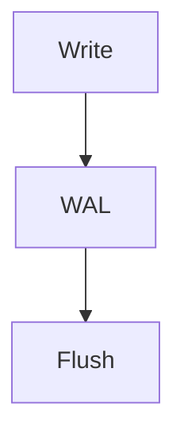

# 📚 Database Internals Study Blog

O'Reilly Database Internals를 기반으로 한 학습 정리 프로젝트
Markdown → HTML 변환을 통해 GitHub Pages로 정적 블로그 운영

## COPILOT GUIDELINES

### 🎯 Purpose

이 프로젝트는 데이터베이스 내부 구조를 학습하고, 이를 읽기 쉬운 블로그 형태의 HTML 문서로 정리하는 것을 목표로 한다.

원문 이해 → 핵심 개념 요약 → 시각화 → HTML 문서화
단순 요약이 아닌 구조적 이해 + 재사용 가능한 지식 정리

### 🧠 Content Principles

1. 핵심 개념 중심 정리
   B-Tree, LSM-Tree, WAL, MVCC 등 주요 개념 명확히 설명
   첫 등장 시 간단한 정의 포함
2. 실무 연결
   PostgreSQL, MySQL, Elasticsearch 사례 포함
   실제 시스템에서 어떻게 사용되는지 설명
3. 불필요한 세부사항 제거
   구현 디테일보다는 구조와 흐름 중심

### 🏗️ File Structure

```text
/blog
  /assets
  index.html
  styles.css
  chapter-01.html
  chapter-02.html

/data # git ignored
  database-internals-origin.pdf # 원본 PDF 파일
  database-internals-origin.txt # 원본 텍스트 파일
  chapter-01.md
  chapter-02.md
  ...
  chapter-N.md

README.md
```

### 🔄 Workflow

1. Markdown으로 초안 작성 (/data)
2. GitHub Copilot Chat을 활용하여 HTML로 변환
3. `/blog`에 HTML 저장
4. Git을 통한 버전 관리 후 GitHub Pages로 배포

### 🧾 HTML Generation Rules (VERY IMPORTANT)

Copilot은 아래 규칙을 반드시 따를 것:

📌 기본 구조

```html
<!DOCTYPE html>
<html lang="ko">
<head>
    <meta charset="UTF-8">
    <title>Chapter X - Title</title>
    <link rel="stylesheet" href="./styles.css">
    <script src="https://cdn.jsdelivr.net/npm/mermaid/dist/mermaid.min.js"></script>
</head>
<body class="chapter-body">

<nav class="chapter-nav">
    <div>
      <a href="index.html">← Home</a>
      <a href="chapter-0X.html">◀ Prev</a>
      <a href="chapter-0X.html">Next ▶</a>
    </div>
    <input type="text" class="chapter-search-box" placeholder="Search..." onkeyup="searchChapter(this.value)">
</nav>

<main>
    <!-- 한국어 요약 -->
    <section class="korean-summary">
        <h1>챕터 제목</h1>
        <p class="meta">작성일: YYYY-MM-DD</p>

        <h2>개요</h2>
        <p></p>

        <h2>핵심 개념</h2>
        <ul></ul>

        <h2>동작 방식</h2>
        <pre><code></code></pre>

        <h2>예시</h2>
        <p></p>

        <h2>다이어그램</h2>
        <pre class="mermaid"></pre>

        <h2>퀴즈</h2>
        <ul></ul>
    </section>

    <!-- 원문 -->
    <section class="original-text">
        <h2>Original English Text</h2>
        <blockquote></blockquote>
    </section>
</main>

<footer class="chapter-footer">
    <p>Database Internals - Chapter X | <a href="https://github.com/anomalyco/database-internals">GitHub</a></p>
</footer>

<script>
    mermaid.initialize({ startOnLoad: true, theme: 'default' });
    
    function searchChapter(query) {
      if (!query) return;
      window.find(query, false, false, true, false, true);
    }
</script>
</body>
</html>
```

### 📊 Diagram Rules (Mermaid)



👉 반드시 <pre class="mermaid"> 사용

### ✍️ Writing Style Guide

- 한국어 중심 + 영어 용어 병기
- 짧은 문장, 명확한 구조
- 개념 → 흐름 → 예시 순서 유지

### 🧪 Quiz Rules

각 챕터 끝에는 반드시 포함:

- 개념 확인 질문 3~5개
- 자세하지만 간결한 답변 포함, 챕터 내용과 연결

### 🧭 Navigation Rules

- 모든 페이지에 이전/다음 링크 포함
- 상대 경로 사용

### 📅 Metadata

각 챕터 상단에 포함:

```html
<p class="meta">
    작성일: YYYY-MM-DD
</p>
```
