# Database Internals

> O'Reilly Alex Petrov

## 3장 - 파일 포맷 (File Format)

> 2026-02-24

```
# 섹션 순서
1) 개요
2) 파일 포맷의 중요성
3) 바이너리 인코딩
4) 기본형
5) 문자열과 가변 길이 데이터
6) 비트 묶음형 데이터: boolean, enum, flag
7) 파일 포맷 설계 원칙
8) 페이지 구조
9) 슬롯 페이지
10) 셀 구조
11) 셀 병합으로 슬롯 페이지 구성
12) 가변 길이 데이터 관리
13) 버전 관리
14) 체크섬
15) 요약
```

### 1) 개요

파일 포맷은 데이터베이스가 디스크에 데이터를 저장하는 방식을 정의합니다. 

**파일 포맷의 핵심 특성:**

- **컴팩트함**: 최소한의 디스크 공간 사용
- **직렬화/역직렬화 용이성**: 디스크 쓰기(write)와 읽기(read) 함수로 빠르게 변환 가능
- **접근 효율성**: 빠른 데이터 검색 및 수정
- **호환성**: 다양한 데이터 타입 지원
- **안정성**: 데이터 무결성 보장

### 2) 파일 포맷의 중요성

**왜 파일 포맷이 중요한가?**

데이터를 효율적으로 디스크에 저장하려면 컴팩트하고 직렬화와 역직렬화가 쉬운 포맷으로 인코딩해야 합니다.

**메모리와 디스크의 접근 방식 차이:**

```
메모리 접근: malloc()/free() 함수 사용
           → 동적 할당/해제 가능
           → 포인터 사용 가능

디스크 접근: read()/write() 함수만 사용
           → 순차 I/O만 가능
           → 포인터 사용 불가능
           → 정확한 바이너리 레이아웃 필수
```

**디스크 저장의 특성:**

- **성능**: 파일 포맷이 나쁘면 같은 연산도 10배 이상 느려질 수 있음
- **저장 공간**: 효율적 인코딩으로 디스크 공간 절약
- **메모리 사용**: 캐시 효율성이 증가
- **유지보수**: 버전 관리로 스키마 변경 대응

### 3) 바이너리 인코딩

**왜 바이너리 인코딩인가?**

메모리에서 말하는 것처럼 디스크도 바이너리 데이터 형식으로 저장합니다. 레코드를 페이지 단위로 저장하는 방법을 알아보기 전에, 우선 키와 데이터 레코드를 바이너리 형식으로 저장하는 방법부터 이해해야 합니다.

```
텍스트 형식:  "123" → 3 bytes (문자 3개)
바이너리 형식: 123 → 4 bytes (int 1개)

차이: 텍스트는 파싱 비용 + 메모리 낭비
     바이너리는 직렬화/역직렬화 매우 빠름
```

**바이너리 인코딩의 장점:**

- 파싱 불필요 (직렬화/역직렬화 간편)
- 고정 크기로 접근 가능 (read/write 최적화)
- 비교/정렬 연산 빠름 (메모리와 동일)
- 컴팩트한 크기 (공간 절약)

**바이너리 포맷의 원칙:**

> 파일, 직렬화 포맷, 통신 프로토콜 등의 모든 바이너리 포맷에 동일하게 적용되는 원칙들이 있습니다.
> 이 원칙들을 이해하는 것이 효율적인 페이지 레이아웃 설계의 기초입니다.

### 4) 기본형 (Primitive Types)

#### 정수형 (Integers)

**Byte Order (엔디안):**

| 엔디안               | 32-bit 값   | 메모리 배치           | 시스템        | 호환성     |
|-------------------|------------|------------------|------------|---------|
| **Big Endian**    | 0x01020304 | [01][02][03][04] | 모토롤라, IBM  | 네트워크 표준 |
| **Little Endian** | 0x01020304 | [04][03][02][01] | Intel, x86 | 대부분의 PC |

**선택 기준:**

```
- 성능: Little Endian (x86 기본)
- 호환성: Big Endian (네트워크 표준 = Network Byte Order)
- 권장: 시스템 표준을 명시적으로 선택
```

#### 부동소수점 (Floating Point)

**IEEE 754 표준:**

| 유형                  | 크기     | 부호 | 지수 | 가수 | 정밀도   | 범위       |
|---------------------|--------|----|----|----|-------|----------|
| **Single (float)**  | 32-bit | 1  | 8  | 23 | ~7자리  | ±3.4e38  |
| **Double (double)** | 64-bit | 1  | 11 | 52 | ~15자리 | ±1.7e308 |

**저장 예시:**

| 수치             | Float 표현   | Hex 값    | 상세            |
|----------------|------------|----------|---------------|
| 42             | 42.0       | 42200000 | 정수는 정확        |
| 42.5           | 42.5       | 42280000 | 0.5 = 정확한 2진수 |
| π (3.14159...) | 3.14159... | 4048F5C3 | 반올림 손실        |

**주의 사항:**

```
문제: 정밀도 손실 가능성
예: 0.1 + 0.2 ≠ 0.3 (부동소수점 연산)

해결책:
- 금융: DECIMAL 타입 사용 (고정 소수점)
- 과학: Double 사용 (정밀도 높음)
```

### 5) 문자열과 가변 길이 데이터

#### 고정 길이 vs 가변 길이 비교

**저장 방식:**

| 방식              | 데이터   | 저장 형태        | 크기      | 접근 속도 | 공간 효율 |
|-----------------|-------|--------------|---------|-------|-------|
| **CHAR(10)**    | "ABC" | "ABC       " | 항상 10B  | 매우 빠름 | 낮음    |
| **VARCHAR(10)** | "ABC" | [3]["ABC"]   | 4-5B    | 약간 느림 | 높음    |
| **TEXT**        | "ABC" | [Ptr → Data] | 8B + 별도 | 느림    | 매우 높음 |

**선택 기준:**

```
CHAR: 고정 길이 (예: 성별 'M'/'F', 우편번호)
VARCHAR: 가변 길이 (예: 사람 이름, 주소)
TEXT: 대용량 (예: 본문, 설명)
```

#### 인코딩 방식 비교 (3가지 통합)

**Pascal String (Length-Prefixed) 방식:**
```
문자열: "ABC"
형식: [크기: 2B][데이터: N bytes]
저장: [3][A][B][C]
장점: 길이를 O(1)에 조회 가능, 메모리 효율 높음
단점: 길이 제한 있음 (2B면 최대 65536 bytes), 접두사 parsing 필수
사용처: MySQL VARCHAR, PostgreSQL TEXT
```

**Null-Terminated 문자열 (UCSD String):**
```
문자열: "ABC"
형식: [데이터]['\0' 종료]
저장: [A][B][C][\0]
장점: 구현 간단, 종료 명확
단점: 길이 조회 시 O(n) 스캔 필요, 이진 데이터(NULL 바이트 포함) 불가
사용처: C/C++ 문자열, 레거시 DB
```

**Fixed-Length 문자열:**
```
문자열: "ABC"
형식: [고정 크기 N bytes]
저장: [A][B][C][공백...] (10B 중 3B만 사용)
장점: 접근 O(1), 오프셋 계산 간단
단점: 공간 낭비 심각, 유연성 낮음
사용처: CHAR(N) 타입, 고정 길이 필드
```

| 방식 | 형식 | 저장 예시 | 크기 | 장점 | 단점 | 사용처 | 접근 성능 |
|-----|------|---------|------|------|------|--------|---------|
| **Length-Prefixed** | `[Length][Data]` | "ABC" → `[3][ABC]` | 1-4B + 데이터 | ✓ 길이 빠른 조회<br>✓ 메모리 효율 높음 | ✗ 길이 제한 있음<br>✗ 접두사 parsing 필요 | MySQL VARCHAR<br>PostgreSQL text | 중간 |
| **Null-Terminated** | `[Data][\\0]` | "ABC" → `[ABC][\\0]` | 데이터 + 1B | ✓ 구현 간단<br>✓ 종료 명확 | ✗ 길이 조회 시 스캔<br>✗ 이진 데이터 문제 | C/C++ 문자열<br>레거시 DB | 낮음 |
| **Fixed-Length** | `[Data - N bytes]` | "ABC" → "ABC       " (10B) | 항상 N bytes | ✓ 접근 O(1)<br>✓ 계산 간단 | ✗ 공간 낭비<br>✗ 유연성 낮음 | CHAR(N) 타입 | 매우 빠름 |

**저장 공간 비교 (100만 개 레코드, 평균 10B 문자열):**

| 방식 | 필요 크기 | 오버헤드 | 공간 효율 |
|-----|---------|--------|---------|
| Length-Prefixed | ~10.4MB | 4B/레코드 | 중간 |
| Null-Terminated | ~10.1MB | 1B/레코드 | 중간 |
| Fixed-Length | ~10MB | 0B/레코드 (고정) | 높음 |

**선택 가이드:**

```
· Length-Prefixed: 일반적 선택 (대부분 DBMS) - Pascal String 형식
· Null-Terminated: 레거시 시스템 또는 C/C++ - UCSD String 형식
· Fixed-Length: 성능 매우 중요한 경우 (접근 O(1))
```

### 6) 비트 묶음형 데이터 (Bit-Packed Data)

#### 데이터 타입별 저장 방식 비교

| 타입          | 저장 단위  | 저장 크기  | 개수          | 공간 효율   | 예시             |
|-------------|--------|--------|-------------|---------|----------------|
| **Boolean** | 1 bit  | 1 bit  | 1개 = 1 bit  | 1B = 8개 | true/false     |
| **Boolean** | 1 byte | 1 byte | 1개 = 1 byte | 1B = 1개 | 최악 (8배 낭비)     |
| **Enum**    | N bits | N bits | 최대 2^N개     | 압축됨     | RED/GREEN/BLUE |
| **Flags**   | 1 bit  | 1 bit  | 여러 개        | 매우 높음   | 비트 마스크         |

**공간 절약 예시:**

```
상황: 사용자 테이블에 8개의 boolean 필드

비효율적 (1byte/필드):
[active: 1B][verified: 1B][deleted: 1B]...[premium: 1B]
= 8 bytes

효율적 (bit-packed):
[flags: 1B] = 8개 boolean 모두 저장
= 1 byte

절약: 87.5% 공간 절약 (8배 효율)
```

#### Boolean 저장 방식 비교

| 방식 | 저장 단위 | 저장 크기 | 접근 속도 | 구현 복잡도 | 공간 효율 | CPU 비용 | 사용 경우 |
|-----|---------|---------|---------|---------|---------|---------|---------|
| **개별 저장** | 1 byte | 1 byte/개 | 매우 빠름 | 간단 | 낭비 (8배) | 낮음 | 프로토타입, 테스트 |
| **Bit-Packing** | 1 bit | 1 bit/개 | 약간 느림 | 복잡 | 효율 (8배 절약) | 높음 | 프로덕션, 대용량 |

**Bit-Packing 예시 (8개 Boolean → 1 byte):**

```
비트 배치:
┌─┬─┬─┬─┬─┬─┬─┬─┐
│0│1│0│1│1│0│0│1│ = 0x59 (16진수)
└─┴─┴─┴─┴─┴─┴─┴─┘
 7 6 5 4 3 2 1 0

코드:
if (byte & (1 << 3)) { /* bit 3 확인 (READ 권한) */ }
byte |= (1 << 3);     /* bit 3 설정 (권한 추가) */ 
byte &= ~(1 << 3);    /* bit 3 제거 (권한 제거) */
```

#### Enum/Flags 저장 방식 비교

| 저장 단위 | 선택지 수 | 필요 bits | 저장 크기 | 공간 절약 | 효율 | 사용 예 |
|---------|---------|---------|--------|---------|------|--------|
| **1 bit** | 2개 | 1 bit | 1 bit | 87.5% | 128배 | on/off |
| **2 bits** | 4개 | 2 bits | 2 bits | 75% | 32배 | 크기/색상 (S, M, L, XL) |
| **3 bits** | 8개 | 3 bits | 3 bits | 62.5% | 21배 | 요일 (MON-SUN) |
| **4 bits** | 16개 | 4 bits | 4 bits | 50% | 16배 | 16진수 (0x0-0xF) |
| **8 bits** | 256개 | 8 bits | 1 byte | 0% | 1배 | 문자 (0x00-0xFF) |

**저장 효율 (1000만 사용자, 4개 boolean + 2개 enum):**

| 저장 방식 | 저장 크기 | 총 크기 | 절약 효과 |
|---------|---------|--------|---------|
| 개별 저장 (각 1B) | 6B/사용자 | 60MB | - |
| Bit-Packing | 1B/사용자 | 10MB | **83% 절약 (50MB)** |

**선택 가이드:**

```
· 2개 이하 (on/off): 1 bit
· 4개: 2 bits
· 8개: 3 bits  
· 16개: 4 bits
· 256개 이상: 1 byte (또는 전문 인코딩)
```

#### Flags (비트 마스크) 관련 개념

**정의:**
- 플래그는 Packed Boolean과 Enum의 조합
- 상호배타적이지 않은 이름 있는 boolean 매개변수 표현
- 각 비트가 하나의 플래그 값 표현

**비트마스크 정의 (2의 거듭제곱 사용):**

```c
int IS_LEAF_MASK = 0x01h;         // bit #0: 리프 노드 여부
int VARIABLE_SIZE_VALUES = 0x02h; // bit #1: 가변 크기 값 여부
int HAS_OVERFLOW_PAGES = 0x04h;   // bit #2: 오버플로우 페이지 여부
```

**비트 연산 코드:**

```c
// 비트 설정 (OR 연산)
flags |= HAS_OVERFLOW_PAGES;      // 플래그 설정
flags |= (1 << 2);               // 또는 비트시프트 사용

// 비트 해제 (AND + NOT 연산)
flags &= ~HAS_OVERFLOW_PAGES;     // 플래그 해제
flags &= ~(1 << 2);              // 또는 비트시프트 사용

// 비트 테스트
is_set = (flags & HAS_OVERFLOW_PAGES) != 0;  // 플래그 확인
is_set = (flags & (1 << 2)) != 0;            // 또는 비트시프트 사용
```

**실제 사용 예시:**

페이지 헤더에서 다양한 정보를 플래그로 표현:
```
- 페이지가 값 셀을 보유하는지 여부
- 값이 고정 크기인지 가변 크기인지 여부
- 이 노드와 연관된 오버플로우 페이지 존재 여부
```

**저장 효율 (1000만 사용자):**

| 방식              | 저장 크기            | 비고       |
|-----------------|------------------|----------|
| **Boolean 각각**  | 4B × 4 = 16B/사용자 | 160MB    |
| **Bit-Packing** | 1B/사용자           | 10MB     |
| **절약**          | 94% 감소           | 150MB 절약 |

### 7) 파일 포맷 설계 원칙

**효율적인 페이지 레이아웃 설계**

레코드를 페이지 단위로 저장하기 전에 다음 사항들을 먼저 이해해야 합니다:

1. **키와 데이터 레코드를 바이너리 형식으로 저장하는 방법**
2. **여러 값을 복잡한 단일 구조로 표현하는 방법**
3. **가변 길이 자료형과 배열을 구현하는 방법**

이러한 모든 바이너리 포맷(파일, 직렬화 포맷, 통신 프로토콜 등)에 동일하게 적용되는 핵심 설계 원칙들이 있습니다.

#### 3가지 핵심 설계 원칙

| 원칙         | 설명                | 좋은 예          | 나쁜 예             | 영향     |
|------------|-------------------|---------------|------------------|--------|
| **정렬 가능성** | 바이너리로 직접 비교 가능    | Big-Endian 정수 | 부호 있는 정수 (음수 표현) | 인덱싱 성능 |
| **호환성**    | 버전 변경 시 기존 데이터 읽기 | Version 필드 포함 | 고정된 포맷           | 유지보수성  |
| **공간 효율성** | 패딩 최소화            | 정렬된 배치        | 랜덤 배치 + 패딩       | 저장 공간  |

#### 원칙 1: 정렬 가능성 (Sortability)

**문제: 부호 있는 정수**

```
바이너리 비교로 정렬하려면?

양수: 0x00000001 (1), 0x00000002 (2), ... ✓ 정렬 가능
음수: 0xFFFFFFFF (-1), 0xFFFFFFFE (-2), ...
      → 이진수로 비교하면 0xFFFFFFFF > 0xFFFFFFFE
      → 하지만 실제: -1 > -2 ✗ (역순!)
```

**해결책: 부호 변환 (Sign Flip)**

```
음수를 저장할 때 부호 비트 반전
읽을 때 다시 반전

결과: 바이너리 정렬과 실제 값 정렬이 일치
```

#### 원칙 2: 호환성 (Compatibility)

**버전 관리 전략:**

| 버전     | 구조                                             | 처리 방식 |
|--------|------------------------------------------------|-------|
| **V1** | `[id: 4B][name: 50B]`                          | 기본    |
| **V2** | `[id: 4B][name: 50B][email: 100B]`             | 필드 추가 |
| **V3** | `[id: 4B][name: 50B][email: 100B][phone: 20B]` | 추가 확장 |

**Reader 호환성 로직:**

```
1. Version 번호 읽기
2. if Version == 1:
      Parse: id, name
      Use default for: email, phone
   else if Version == 2:
      Parse: id, name, email
      Use default for: phone
   else if Version == 3:
      Parse: id, name, email, phone
```

**호환성 규칙:**

| 작업        | 호환성   | 비고             |
|-----------|-------|----------------|
| **필드 추가** | ✓ 호환  | 끝에만 추가, 기본값 사용 |
| **필드 제거** | ✗ 불호환 | 이전 버전 읽을 수 없음  |
| **타입 변경** | ✗ 불호환 | 크기 변경으로 오류     |
| **위치 변경** | ✗ 불호환 | 읽는 순서 혼동       |

#### 원칙 3: 공간 효율성 (Space Efficiency)

**패딩 문제:**

```
구조 1 (비효율):
[byte1: 1B][padding: 3B][int32: 4B] = 8B
           └─ CPU 정렬 때문에 발생

구조 2 (효율):
[int32: 4B][byte1: 1B][padding: 3B] = 8B
           └─ 적어도 더 자주 사용하는 필드부터

구조 3 (최적):
[int32: 4B][int32: 4B][byte1: 1B] = 9B
           └─ 패딩을 피하거나 최소화
```

**정렬 규칙 (Memory Alignment):**

| 타입        | 크기 | 정렬 | 예            |
|-----------|----|----|--------------|
| **byte**  | 1B | 1B | 0-7          |
| **short** | 2B | 2B | 0, 2, 4, 6   |
| **int**   | 4B | 4B | 0, 4, 8, 12  |
| **long**  | 8B | 8B | 0, 8, 16, 24 |

**레이아웃 최적화:**

```
비효율:
[byte][short][byte] = 1+2+1+패딩 = 6B + 2B 낭비

효율:
[byte][byte][short] = 1+1+2 = 4B (패딩 없음!)

또는:
[short][byte][byte] = 2+1+1 = 4B (패딩 없음!)
```

**저장 공간 비교 (100만 레코드):**

| 레이아웃  | 크기/레코드 | 총 크기   | 낭비        |
|-------|--------|--------|-----------|
| 비최적   | 12B    | 12MB   | 3MB (25%) |
| 최적화   | 9B     | 9MB    | 0         |
| 효율 개선 | 25% 절약 | 3MB 회수 | -         |

### 8) 페이지 구조 (Page Structure)

**페이지: 디스크 I/O의 최소 단위**

```
일반적 크기: 4KB ~ 16KB (보통 4KB)
이유: 대부분의 파일시스템 블록 크기와 일치
     효율적인 I/O 성능
```

**페이지 레이아웃:**

```
┌────────────────────────────────────────────┐
│  Header (50-100 bytes)                     │
│  - Magic Number (검증용, 예: "PAGE")       │
│  - Page Type (데이터/인덱스)               │
│  - Item Count (셀의 개수)                  │
│  - Lower Offset (셀 포인터 끝)             │
│  - Upper Offset (셀 데이터 시작)           │
│  - Free Space Info                        │
├────────────────────────────────────────────┤
│  Free Space                                │
│  (Lower와 Upper 사이의 빈 공간)             │
├────────────────────────────────────────────┤
│  Cell Pointer Array (Lower ← Upper)        │
│  [Offset to Cell 1]                        │
│  [Offset to Cell 2]                        │
│  ...                                       │
│  [Offset to Cell N]                        │
├────────────────────────────────────────────┤
│  Cell Data Area (Upper ← Lower)            │
│  [Cell N data]                             │
│  [Cell N-1 data]                           │
│  ...                                       │
│  [Cell 1 data]                             │
└────────────────────────────────────────────┘
```

**Header 항목 상세 설명:**

| 항목 | 크기 | 목적 | 예시 |
|-----|------|------|------|
| **Magic Number** | 4B | 페이지 검증, 버전 식별 | 0x50414745 ("PAGE") |
| **Page Type** | 1B | 페이지 종류 구분 | ROOT(0x00), LEAF(0x02) |
| **Item Count** | 2B | 셀 개수 | 예: 150개 |
| **Lower Offset** | 2B | 셀 포인터 영역 끝 | 예: 100 |
| **Upper Offset** | 2B | 셀 데이터 영역 시작 | 예: 3900 |
| **Flags** | 1B | 페이지 상태 플래그 | IS_LEAF, VARIABLE_SIZE |

**설계 특징: Bi-directional Growth**

```
이유: 
1. 가변 크기 레코드 효율적 관리
2. 삭제 시 공간 재활용 용이
3. 포인터 배열 유연한 관리

동작:
- 포인터 배열은 앞(Lower)에서부터 증가
- 셀 데이터는 뒤(Upper)에서부터 증가
- 충돌하면 페이지가 꽉 참
```

**예시:**

```
삽입 전:
┌──────────┬────────────────────┬──────────┐
│ Header   │   Free Space       │ Cells    │
│ L=100    │                    │ U=3900   │
└──────────┴────────────────────┴──────────┘

새로운 셀 삽입 후:
┌──────────┬─────────┬──────────┬─┬────────┐
│ Header   │Pointers │Free Space│▼│Cells   │
│ L=102    │         │          │ │U=3850  │
└──────────┴─────────┴──────────┴─┴────────┘
(포인터 2B 증가, 셀 데이터 50B 감소)
```
이유: 레코드 삭제 시 효율적 공간 관리

```
삽입 후:
┌─────────────────────┐
│ [Rec1][Rec2]        │
│        [off2][off1] │
└─────────────────────┘

Rec1 삭제 후:
┌─────────────────────┐
│        [Rec2]       │
│        [off2]       │
│   (공간 재사용 가능) │
└─────────────────────┘
```

### 9) 슬롯 페이지 (Slotted Page)

**문제: 가변 크기 레코드의 공간 관리**

```
고정 크기 세그먼트 사용의 문제:
- 64B 세그먼트에 50B 레코드 저장 → 14B 낭비
- 새 레코드를 적절한 세그먼트에 못 찾으면 공간 낭비
- 삭제 시 공간 조각화(Fragmentation) 발생

해결 방법: Slot Directory (또는 Slotted Page)
```

**필수 요구사항:**

1. 가변 크기 레코드를 최소 오버헤드로 저장
2. 삭제된 레코드 공간 회수 가능
3. 페이지 외부에서 레코드를 정확한 위치와 무관하게 참조 가능

**구조:**

```
┌────────────────────────────────────────────┐
│  Header                                    │
│  - Slot Count: 2                           │
│  - Free Space: 1000 bytes                  │
├────────────────────────────────────────────┤
│                                            │
│  Free Space                                │
│  (Lower와 Upper 사이의 빈 공간)             │
│                                            │
├────────────────────────────────────────────┤
│  Slot Directory (Lower ← Upper)            │
│  ┌──────────────────────────────┐          │
│  │ Slot 1: [offset=50, size=30] │          │
│  │ Slot 0: [offset=80, size=40] │          │
│  └──────────────────────────────┘          │
├────────────────────────────────────────────┤
│  Cell Data (Upper ← Lower)                 │
│  ┌────────────────────────────────────────┐│
│  │ Slot 0 Data (40 bytes)                 ││
│  ├────────────────────────────────────────┤│
│  │ Slot 1 Data (30 bytes)                 ││
│  └────────────────────────────────────────┘│
└────────────────────────────────────────────┘
```

**장점:**

| 장점 | 설명 |
|-----|------|
| **Minimal Overhead** | 포인터 배열만 오버헤드 (2B/슬롯) |
| **Space Reclamation** | 페이지 리라이트로 공간 회수 가능 |
| **Dynamic Layout** | 페이지 내부에서 슬롯 위치 변경 가능, 외부에서는 슬롯 ID로만 참조 |

**예시: 삭제 후 공간 관리**

```
삭제 전: Slot 0과 Slot 1 모두 활성
Slot 0: offset=80, size=40
Slot 1: offset=50, size=30

Slot 0 삭제 후: 
Slot 0: [deleted]  (포인터 제거 또는 무효화)
Slot 1: offset=50, size=30

공간 회수 불필요: 셀 0은 이미 주소 불가능

defragmentation 필요 시:
Slot 1: offset=50 → offset=20으로 재배치
```

### 10) 셀 구조 (Cell Structure)

**개념:**

- 셀: 페이지 내에서 실제 데이터를 저장하는 단위
- 키 셀(Key Cell): 구분 키와 자식 페이지 포인터 저장
- 키-값 셀(Key-Value Cell): 키와 데이터 레코드 저장

**통일된 구조:**
모든 셀이 균일함 (모두 키만, 모두 키-값)
메타데이터는 페이지 레벨에서 한 번만 저장

**Key Cell 구조:**

```
목적: B-Tree 내부 노드에서 구분 키와 자식 포인터 저장

레이아웃 (가변 크기 키):
0       4       8       (8 + key_size)
+-------+-------+-------+-------------------+
| Key   | Page  | [Padding for alignment]   |
| Size  | ID    |                           |
| (int) | (int) | [Key Bytes]               |
+-------+-------+-------+-------------------+

고정 크기 키는 Key Size 필드 제거
```

**Key-Value Cell 구조:**

```
목적: B-Tree 리프 노드에서 키와 데이터 저장

레이아웃:
0     1     5       9       9+key_size            9+key_size+value_size
+-----+-----+-------+-------+-------------------+-------------------+
|Flag | Key | Value | (Padding for alignment)   |                   |
|     |Size | Size  |                           | Key Bytes | Value |
|(1B) |(4B) | (4B)  |                           | Bytes     | Bytes |
+-----+-----+-------+-------+-------------------+-------------------+

구조:
- 고정 크기 필드 우선 배치: 정적 오프셋으로 접근 가능
- 가변 크기 필드 나중 배치: 오프셋 계산으로 접근
```

**접근 방법:**

| 필드 | 계산 방법 | 비고 |
|-----|----------|------|
| **Key** | 헤더 건너뛰기 + key_size 바이트 읽기 | 고정 크기 헤더로 시작 위치 명확 |
| **Value** | 헤더 + key_size 건너뛰기 + value_size 바이트 읽기 | 마찬가지로 명확한 계산 |

**예시: 실제 저장**

```
사용자 레코드: ID=12345, Name="John", Age=30

Key-Value Cell:
0        1      5           9               14      18
[Flags][KeyLen][ValueLen][Padding][12345]["John"][30...]

Flag: 0x01 (가변 크기 셀)
KeyLen: 4
ValueLen: 7
Key: 12345 (4B)
Value: "John" (4B) + Age:30 (1B) = 5B 실제
```

### 11) 셀 병합으로 슬롯 페이지 구성

**핵심 개념:**

- 셀은 삽입 순서대로 저장 (앞에서 뒤로)
- 슬롯 포인터는 논리적 정렬 순서 유지 (정렬됨)
- 바이너리 서치를 위해 슬롯 포인터만 정렬

**삽입 과정:**

```
초기 상태:
┌─────────────────────────┐
│ Slot 0: [off=X, len=25] │
│ Slot 1: [off=Y, len=28] │
│ Slot 2: [off=Z, len=22] │
├─────────────────────────┤
│ [Cell 0][Cell 1][Cell 2]│
└─────────────────────────┘

Slot 1 삭제 후:
┌─────────────────────────┐
│ Slot 0: [off=X, len=25] │
│ Slot 1: DELETED         │
│ Slot 2: [off=Z, len=22] │
├─────────────────────────┤
│ [Cell 0]    [Cell 2]    │ (Cell 1 공간 해제)
│     ↓ Free Space ↑      │
└─────────────────────────┘
```

### 12) 가변 길이 데이터 관리

**문제: VARCHAR, TEXT, BLOB 등의 대용량 데이터 저장**

#### 3가지 저장 방식 통합 비교

| 방식 | 저장 위치 | 데이터 크기 | I/O 횟수 | 접근 성능 | 메모리 사용 | 장점 | 단점 | 사용 경우 |
|-----|---------|---------|--------|---------|---------|------|------|---------|
| **Inline** | 페이지 내부 | < 1KB | 1회 | 매우 빠름 | 매우 적음 | ✓ 빠른 접근<br>✓ 간단함 | ✗ 페이지 오버플로우<br>✗ 크기 제한 | 작은 데이터 (< 100B) |
| **Overflow** | 별도 페이지 | 1KB-10MB | 2-N회 | 중간 | 적음 | ✓ 페이지 유연<br>✓ 중간 크기 지원 | ✗ 포인터 추적<br>✗ I/O 증가 | 중간 크기 (1KB-10KB) |
| **External** | 외부 저장소 (S3/Blob) | 무제한 | N회 (네트워크) | 느림 | 많음 | ✓ 무제한 크기<br>✓ 확장성 | ✗ 느린 접근<br>✗ 네트워크 의존 | 큰 데이터 (> 10KB) |

**저장 방식별 상세:**

```
Inline Storage:
  메인 페이지: [Header][ID][Name][Content][Offset Array]
  접근: 1회 I/O → 매우 빠름

Overflow Page:
  메인 페이지: [Header][ID][Name][Ptr→Overflow][Offset Array]
  Overflow 1: [Content Part 1][Ptr→Overflow 2]
  Overflow 2: [Content Part 2]
  접근: 1 + ⌈크기/(페이지크기-8)⌉회 I/O

External Storage:
  메인 페이지: [Header][ID][Name][URL][Offset Array]
  외부: S3/Blob에 저장된 파일
  접근: 네트워크 I/O (200ms~)
```

#### 선택 기준 (데이터 크기별)

| 데이터 크기 | 추천 방식 | 이유 | 성능 평가 |
|----------|---------|------|---------|
| **< 100B** | Inline | 페이지 내부 여유, 1회 I/O | ⭐⭐⭐⭐⭐ |
| **100B ~ 1KB** | Inline (일부) | 일부는 Inline, 나머지 Overflow | ⭐⭐⭐⭐ |
| **1KB ~ 10KB** | Overflow | 포인터 비용 < 네트워크 비용 | ⭐⭐⭐ |
| **> 10KB** | External | 네트워크 I/O ≈ 디스크 I/O | ⭐⭐ |

#### 실제 프로젝트 예시 (사용자 프로필)

| 필드 | 크기 | 저장 방식 | 위치 |
|-----|------|---------|------|
| **ID** | 4B | Inline | 메인 페이지 |
| **Name** | 50B | Inline | 메인 페이지 |
| **Bio** | 500B | Inline | 메인 페이지 |
| **Avatar** | 2MB | External | S3 |
| **Banner** | 5MB | External | CDN |
| **총 메인 페이지 크기** | 554B | - | 4KB 이내 |
| **총 데이터 크기** | 7.55MB | 혼합 | 메인 + 외부 |

#### 성능 비교 (100만 사용자, 평균 1MB 데이터)

| 저장 방식 | DB 크기 | 총 I/O 횟수 | 평균 접근 시간 | 적합성 |
|---------|--------|----------|-----------|--------|
| 모두 Inline | 1TB | 250만 | 4-5ms | 불가능 (과부하) |
| Overflow만 | 1TB | 1000만 | 50-100ms | 낮음 |
| External만 | 100GB | 100만 | 200-500ms | 중간 |
| **혼합 전략 (권장)** | 10GB + CDN | 균형 | 10-50ms | **최적** |


### 13) 버전 관리 (Versioning)

**목표: 스키마 변경 시 기존 데이터와의 호환성 유지**

#### 버전 관리 전략

| 전략                   | 구조 변경              | 호환성 | 구현 | 사용처    |
|----------------------|--------------------|-----|----|--------|
| **Embedded Version** | [Ver: 1B][Data...] | 양방향 | 간단 | 소규모 DB |
| **Header Version**   | 페이지 헤더에 Ver        | 양방향 | 중간 | 중간 DB  |
| **Catalog Schema**   | 메타데이터 테이블          | 높음  | 복잡 | 대규모 DB |

#### 데이터 포맷 진화

**Version 1: 기본 구조**

```
┌────────────────────────┐
│ Ver: 1 (1B)            │
│ [id: 4B]               │
│ [name: 50B]            │
│ [age: 1B]              │
├────────────────────────┤
│ 총 크기: 56B           │
└────────────────────────┘
```

**Version 2: 새 필드 추가**

```
┌────────────────────────┐
│ Ver: 2 (1B)            │
│ [id: 4B]               │
│ [name: 50B]            │
│ [age: 1B]              │
│ [email: 100B] ← 새 필드│
├────────────────────────┤
│ 총 크기: 156B          │
└────────────────────────┘
```

**Version 3: 추가 필드 확장**

```
┌────────────────────────┐
│ Ver: 3 (1B)            │
│ [id: 4B]               │
│ [name: 50B]            │
│ [age: 1B]              │
│ [email: 100B]          │
│ [phone: 20B] ← 새 필드 │
├────────────────────────┤
│ 총 크기: 176B          │
└────────────────────────┘
```

#### Reader 호환성 로직

**Version별 처리:**

| 저장 버전  | 읽는 버전     | 동작               | 결과     |
|--------|-----------|------------------|--------|
| **V1** | V1 reader | 일치               | ✓ 완벽   |
| **V1** | V2 reader | V1 파싱 + 기본값      | ✓ 호환   |
| **V1** | V3 reader | V1 파싱 + 기본값      | ✓ 호환   |
| **V2** | V1 reader | V2 파싱 (email 무시) | ✓ 하위호환 |
| **V3** | V1 reader | V3 파싱 (phone 무시) | ✓ 하위호환 |

**구현 예시:**

```java
// 저장할 때
record.setVersion(3);
record.writeToFile();  // Ver:3 + 모든 필드 저장

// 읽을 때
int version = readVersion();
switch (version) {
    case 1:
        id = readInt();
        name = readString(50);
        age = readByte();
        email = "";           // 기본값
        phone = "";           // 기본값
        break;
    case 2:
        id = readInt();
        name = readString(50);
        age = readByte();
        email = readString(100);
        phone = "";           // 기본값
        break;
    case 3:
        id = readInt();
        name = readString(50);
        age = readByte();
        email = readString(100);
        phone = readString(20);
        break;
}
```

#### 호환성 규칙 (필수!)

**안전한 변경:**

| 작업            | 호환성  | 이유     | 예시                  |
|---------------|------|--------|---------------------|
| **필드 추가 (끝)** | ✓ 안전 | 기본값 사용 | email 추가            |
| **필드 크기 증가**  | ✓ 안전 | 여유 생김  | varchar(50) → (100) |
| **필드 타입 호환**  | ✓ 안전 | 자동 변환  | int → long          |

**위험한 변경:**

| 작업            | 호환성  | 문제            | 예시                  |
|---------------|------|---------------|---------------------|
| **필드 제거**     | ✗ 위험 | 이전 버전 읽을 수 없음 | age 필드 삭제           |
| **필드 위치 변경**  | ✗ 위험 | 오프셋 혼동        | name과 age 위치 바뀜     |
| **필드 크기 감소**  | ✗ 위험 | 데이터 손실        | varchar(100) → (50) |
| **필드 가운데 삽입** | ✗ 위험 | 오프셋 모두 변함     | age와 email 사이에 삽입   |

#### 버전 업그레이드 전략

**온라인 마이그레이션:**

```
기존: Version 1 데이터 저장
신버전: Version 3 reader 구현
↓
읽을 때: V1 → 메모리에 V3로 변환
쓸 때: V3로 저장 (마이그레이션 완료)

장점: 다운타임 없음
```

**오프라인 마이그레이션:**

```
기존: Version 1 모든 데이터
단계:
1. V1 reader + V3 writer 구현
2. 전체 데이터 다시 쓰기 (V3 포맷)
3. 버전 확인 및 검증
4. 레거시 V1 reader 제거 가능

시간: 데이터 양에 따라 수시간~수일
```

#### 실제 데이터베이스 버전 관리

**SQLite 버전 관리:**

```
파일 헤더 (위치 18-19):
- Version Number 저장
- 호환성 확인 시 체크
```

**PostgreSQL 버전 관리:**

```
pg_class.relfilenode
- 테이블 파일 식별자
- 스키마 변경 시 새 파일 생성
- 버전 호환성은 내부적으로 관리
```

**MySQL 버전 관리:**

```
.frm 파일 (포맷 메타데이터)
- 스키마 정의 저장
- 재구성 시 자동으로 처리
```

### 14) 체크섬 (Checksum)

**목적: 데이터 무결성 검증 (오류 감지)**

#### 체크섬 저장 포맷

```
┌────────────────────────────────────────┐
│ [Checksum: 4B][Data: N bytes]          │
├────────────────────────────────────────┤
│ 예: CRC32=0x12345678[실제 데이터...]   │
└────────────────────────────────────────┘
```

#### 체크섬 방식 상세 비교

| 방식           | 크기  | 속도    | 에러 감지 | 충돌    | 용도      | 계산식                 |
|--------------|-----|-------|-------|-------|---------|---------------------|
| **XOR**      | 1B  | 매우 빠름 | 매우 낮음 | 높음    | 간단한 검증  | byte1 ^ byte2 ^ ... |
| **Checksum** | 2B  | 빠름    | 낮음    | 높음    | 레거시     | (모든 byte의 합) % 256  |
| **CRC32**    | 4B  | 빠름    | 중간    | 매우 낮음 | 대부분의 DB | 다항식 계산              |
| **CRC64**    | 8B  | 중간    | 높음    | 매우 낮음 | 고신뢰     | 다항식 계산              |
| **MD5**      | 16B | 느림    | 매우 높음 | 매우 낮음 | 파일 검증   | 해시 함수               |
| **SHA256**   | 32B | 매우 느림 | 매우 높음 | 거의 없음 | 보안 중요   | 해시 함수               |

#### 체크섬 계산 방식별 예시

**1) XOR (가장 간단)**

```
데이터: [0x12, 0x34, 0x56, 0x78]
계산: 0x12 ^ 0x34 ^ 0x56 ^ 0x78 = 0x60
저장: [0x60][0x12][0x34][0x56][0x78]

검증할 때:
읽은 체크섬: 0x60
계산된 체크섬: 0x12 ^ 0x34 ^ 0x56 ^ 0x78 = 0x60
비교: 일치 ✓
```

**단점:**

```
[0x12, 0x34] XOR = 0x26
[0x34, 0x12] XOR = 0x26 (순서 바뀌어도 같음!) ← 문제
```

**2) CRC32 (가장 일반적)**

```
데이터: "Hello" = [0x48, 0x65, 0x6C, 0x6C, 0x6F]
초기값: 0xFFFFFFFF
다항식: 0xEDB88320
계산: (복잡한 비트 연산...)
결과: 0xF7D18982

저장: [0xF7, 0xD1, 0x89, 0x82][0x48][0x65][0x6C][0x6C][0x6F]

장점:
- 80비트 에러까지 감지
- 계산 빠름
- 표준화됨
```

**3) SHA256 (가장 안전)**

```
데이터: "Hello" 
SHA256 = 185F8DB32271FE25F561...

특징:
- 충돌 불가능 (현재까지)
- 1비트 변경 → 전혀 다른 값
- 매우 느림 (마이크로초 vs 나노초)

사용: 금융, 보안 중요 시스템
```

#### 검증 프로세스

**저장 프로세스:**

```java
// 1단계: 데이터 준비
byte[] data = getRecordData();        // 레코드 데이터
int checksum = calculateChecksum(data); // 체크섬 계산

// 2단계: 저장
writePage(checksum, data);            // 페이지에 저장
```

**읽기 프로세스:**

```java
// 1단계: 읽기
int storedChecksum = readChecksum();  // 저장된 체크섬
byte[] data = readData();             // 데이터 읽기

// 2단계: 검증
int computedChecksum = calculateChecksum(data);
if (storedChecksum != computedChecksum) {
    throw new CorruptedDataException(
        "Checksum mismatch: " + 
        storedChecksum + " != " + computedChecksum
    );
}
```

#### 체크섬 적용 대상

| 대상      | 레벨 | 빈도    | 비용 | 효과 |
|---------|----|-------|----|----|
| **페이지** | 물리 | 매 I/O | 저  | 높음 |
| **레코드** | 논리 | 매 쓰기  | 중  | 중간 |
| **파일**  | 전역 | 주기적   | 높음 | 낮음 |

**MySQL InnoDB 체크섬:**

```sql
-- 페이지 체크섬 활성화
SET innodb_checksum_algorithm = crc32;

-- 실시간 검증
-- 모든 페이지 I/O 시 CRC32 확인
-- 손상 감지 시 자동 복구 시도
```

**PostgreSQL 페이지 검증:**

```c
// pg_control 파일
// - 데이터베이스 메타데이터
// - CRC32 체크섬 포함
// - 시작 시 검증
```

#### 체크섬 오류 처리 전략

**1단계: 감지**

```
체크섬 불일치 발견
→ 데이터 손상 확인
```

**2단계: 처리**

| 전략      | 방식      | 위험도   |
|---------|---------|-------|
| **무시**  | 진행      | 매우 높음 |
| **에러**  | 작업 중단   | 낮음    |
| **복구**  | 백업에서 복원 | 중간    |
| **재시도** | 다시 읽기   | 중간    |

**권장:**

```
1. 첫 감지: 에러 로그 기록
2. 재시도: 디스크에서 다시 읽기
3. 여전히 실패: 백업에서 복원
4. 마지막: 관리자 알림
```

#### 성능 오버헤드 비교

**1,000,000개 데이터 읽기:**

| 체크섬        | 계산 시간 | 총 시간   | 오버헤드 |
|------------|-------|--------|------|
| **없음**     | 0ms   | 1000ms | 0%   |
| **XOR**    | 10ms  | 1010ms | 1%   |
| **CRC32**  | 50ms  | 1050ms | 5%   |
| **SHA256** | 500ms | 1500ms | 50%  |

**선택 기준:**

```
일반적: CRC32 (5% 오버헤드, 높은 신뢰도)
초고성능: XOR (1% 오버헤드)
금융/보안: SHA256 (50% 오버헤드 감수)
```

### 15) 요약

#### 파일 포맷 설계 체크리스트 (15단계)

| #  | 항목                 | 확인 사항                        | 체크 | 비고           |
|----|--------------------|------------------------------|----|--------------|
| 1  | **인코딩**            | 텍스트 vs 바이너리 선택               | ⬜  | 바이너리 권장      |
| 2  | **엔디안**            | Big-Endian or Little-Endian  | ⬜  | 네트워크: BE     |
| 3  | **부동소수점**          | IEEE 754 표준 준수               | ⬜  | 금융: DECIMAL  |
| 4  | **문자열 길이**         | Length-Prefixed or Null-Term | ⬜  | LP 권장        |
| 5  | **고정 길이**          | 가능하면 고정 길이 사용                | ⬜  | 성능 향상        |
| 6  | **정렬 가능성**         | 바이너리 정렬 지원                   | ⬜  | 인덱스 필수       |
| 7  | **Bit-Packing**    | Boolean/Enum 압축              | ⬜  | 공간 절약        |
| 8  | **버전 관리**          | Version 필드 포함                | ⬜  | 호환성 필수       |
| 9  | **페이지 레이아웃**       | 헤더 + 데이터 + 오프셋               | ⬜  | Slotted Page |
| 10 | **정렬 (Alignment)** | 바이트 정렬 최적화                   | ⬜  | 패딩 최소화       |
| 11 | **메타데이터**          | 길이, 타입, 플래그                  | ⬜  | 유연성 확보       |
| 12 | **가변 길이 처리**       | Inline/Overflow/External     | ⬜  | 크기별 선택       |
| 13 | **체크섬**            | CRC32 또는 SHA256              | ⬜  | 무결성 보장       |
| 14 | **압축**             | 압축 사용 여부                     | ⬜  | 공간 vs CPU    |
| 15 | **문서화**            | 포맷 명세 문서 작성                  | ⬜  | 유지보수         |

#### 파일 포맷 설계 9가지 핵심 원칙

| # | 원칙         | 설명         | 효과      | 우선순위 |
|---|------------|------------|---------|------|
| 1 | **정렬 가능성** | 바이너리 정렬 지원 | 인덱싱 최적화 | ⭐⭐⭐  |
| 2 | **호환성**    | 버전 관리      | 진화 가능   | ⭐⭐⭐  |
| 3 | **공간 효율성** | 패딩 최소화     | I/O 감소  | ⭐⭐⭐  |
| 4 | **성능**     | 바이너리 고정크기  | 빠른 접근   | ⭐⭐   |
| 5 | **무결성**    | 체크섬        | 오류 감지   | ⭐⭐⭐  |
| 6 | **유연성**    | 메타데이터      | 기능 확장   | ⭐⭐   |
| 7 | **이해가능성**  | 문서화        | 유지보수 용이 | ⭐    |
| 8 | **보안**     | 암호화        | 데이터 보호  | ⭐    |
| 9 | **복구 가능성** | 중복 정보      | 손상 복구   | ⭐    |

#### 설계 단계별 결정 플로우

```
1. 데이터 타입 정의
   ├─ Fixed-Length? → 고정크기 선택
   └─ Variable-Length? → Inline/Overflow/External

2. 인코딩 방식 선택
   ├─ 정수? → 엔디안 표준화
   ├─ 문자열? → Length-Prefixed 권장
   └─ Boolean? → Bit-Packing

3. 정렬 및 패딩
   ├─ 컬럼 크기 큰순 정렬
   └─ 패딩 제거

4. 버전 관리
   ├─ Version 필드 추가
   └─ Reader 호환성 구현

5. 검증
   ├─ 체크섬 추가
   └─ 무결성 검증 로직

6. 최적화
   ├─ 성능 테스트
   └─ 메모리 프로파일링
```

#### 실제 데이터베이스 파일 포맷 비교

**SQLite 페이지 헤더 (100 bytes):**

| 오프셋   | 크기  | 필드                      | 설명                |
|-------|-----|-------------------------|-------------------|
| 0-15  | 16B | Header String           | "SQLite format 3" |
| 16-17 | 2B  | Page Size               | 페이지 크기 (보통 4096)  |
| 18    | 1B  | File Format Version     | 파일 버전             |
| 19    | 1B  | Recommended pager cache | 캐시 권장             |
| 20-23 | 4B  | Number of pages         | 전체 페이지 수          |
| 24-27 | 4B  | Number of free pages    | 빈 페이지 수           |
| 28-31 | 4B  | First free list page    | 첫 빈 페이지           |
| ...   | ... | ...                     | ...               |
| 96-99 | 4B  | Checksum                | CRC32 체크섬         |

**PostgreSQL HEAP 레코드 헤더:**

| 필드          | 크기       | 설명                  |
|-------------|----------|---------------------|
| t_xmin      | 4B       | 삽입 트랜잭션 ID          |
| t_xmax      | 4B       | 삭제 트랜잭션 ID (0 = 유효) |
| t_cid       | 4B       | 명령 ID               |
| t_ctid      | 6B       | 레코드 위치 (페이지 + 오프셋)  |
| t_infomask  | 2B       | 플래그 비트              |
| t_infomask2 | 2B       | 추가 플래그              |
| t_hoff      | 1B       | 헤더 길이               |
| t_bits      | variable | Null 비트맵            |

**MySQL InnoDB 레코드 포맷 (Compact):**

```
┌──────────────────────────────────────┐
│ Variable-Length Field Length List    │
│ (각 VARCHAR 길이)                    │
├──────────────────────────────────────┤
│ Null Bitmap                          │
│ (Null 플래그들)                       │
├──────────────────────────────────────┤
│ Transaction ID (6B)                  │
│ Roll Pointer (7B)                    │
├──────────────────────────────────────┤
│ Actual Column Data                   │
│ (Fixed: 고정크기 컬럼)                 │
│ (Variable: 가변크기 컬럼)              │
└──────────────────────────────────────┘
```

#### 성능 최적화 체크리스트 (5가지 팁)

| 팁                  | 실행              | 효과            | 난이도 |
|--------------------|-----------------|---------------|-----|
| **1. 컬럼 배치**       | 자주 접근 컬럼을 앞에    | CPU 캐시 hit 증가 | ⭐   |
| **2. 타입 선택**       | 고정길이 우선         | I/O 성능 3배 ↑   | ⭐   |
| **3. Bit-Packing** | Boolean/Enum 압축 | 저장 공간 87% ↓   | ⭐⭐  |
| **4. 정렬 최적화**      | 패딩 제거           | 저장 공간 25% ↓   | ⭐⭐  |
| **5. 인라인 전략**      | 작은 데이터만 인라인     | I/O 횟수 감소     | ⭐   |

#### 의사 결정 가이드 (언제 뭘 사용?)

**Q1: 저장 공간이 부족한가?**

```
YES → Bit-Packing 적용 (Boolean/Enum)
      Overflow 페이지 활용
      외부 저장소 고려
```

**Q2: 성능이 느린가?**

```
YES → 고정 길이 타입 사용
      컬럼 배치 최적화
      불필요한 메타데이터 제거
```

**Q3: 데이터 무결성 중요한가?**

```
YES → CRC32 체크섬 필수
      중복 저장 고려
      백업 전략 수립
```

**Q4: 미래 확장이 필요한가?**

```
YES → 버전 관리 구현
      필드를 끝에 추가 가능하게 설계
      Reserved 공간 확보
```

#### 실제 프로젝트 체크리스트

```
□ 데이터 타입 정의 문서 작성
□ 엔디안 표준 선택 (보통 Little-Endian)
□ 문자열 인코딩 선택 (UTF-8 권장)
□ 정렬 및 패딩 계산
□ 버전 관리 전략 수립
□ 체크섬 방식 선택 (CRC32 권장)
□ 테스트 케이스 작성
  - 정상 데이터
  - 경계값
  - 손상 데이터
□ 성능 벤치마크
□ 문서화 및 주석
□ 코드 리뷰
□ 실제 데이터로 테스트
```

## 2장 - B-트리 개요

> 2026-02-10

### 개요

B-트리(B-Tree)는 데이터베이스와 파일 시스템에서 널리 사용되는 자가-균형 이진 탐색 트리의 일반화된 형태입니다. 대규모 데이터셋을 효율적으로 저장하고 검색하기 위해 설계되었습니다.

### 핵심 개념

#### 1. B-트리의 정의

- **균형 트리**: 모든 리프 노드가 동일한 깊이에 있어 검색 성능이 균일합니다
- **다중 자식**: 각 노드는 여러 개의 자식 노드를 가질 수 있습니다
- **정렬된 키**: 각 노드 내에서 키는 정렬된 순서로 유지됩니다

#### 2. B-트리의 속성

- **차수(Order) m**: 각 노드는 최대 m개의 자식을 가질 수 있습니다
- **최소 키 개수**: 루트 제외 모든 노드는 최소 ⌈m/2⌉ - 1개의 키를 포함합니다
- **최대 키 개수**: 각 노드는 최대 m - 1개의 키를 포함합니다
- **leaf 노드**: 데이터 포인터를 직접 포함합니다

#### 3. 노드 구조

```
[key1, key2, ..., keyN] -> [child1, child2, ..., childN+1]
```

- 각 키는 left subtree와 right subtree를 분리합니다
- 데이터 값은 리프 노드에만 저장됩니다

### B-트리의 장점

| 장점             | 설명                            |
|----------------|-------------------------------|
| **균형 보장**      | 항상 균형잡힌 구조로 O(log N) 검색 성능 보장 |
| **디스크 I/O 효율** | 한 번의 노드 접근으로 여러 키를 검토 가능      |
| **범위 쿼리 효율**   | 정렬된 순서로 인해 범위 쿼리가 효율적         |
| **삽입/삭제 효율**   | 자가-균형 메커니즘으로 O(log N) 성능 유지   |

### 주요 연산

#### 검색 (Search)

1. 루트에서 시작하여 적절한 키를 찾습니다
2. 찾은 키보다 작으면 left subtree, 크면 right subtree로 이동
3. 리프 노드까지 재귀적으로 진행

#### 삽입 (Insertion)

1. 삽입할 위치의 리프 노드를 찾습니다
2. 노드가 가득 찬 경우, 중간값을 기준으로 분할합니다
3. 분할로 인한 오버플로우가 발생할 때까지 상향식으로 진행됩니다

#### 삭제 (Deletion)

1. 삭제할 키를 찾습니다
2. 내부 노드인 경우 predecessor 또는 successor로 교체합니다
3. 언더플로우가 발생하면 형제 노드로부터 차용하거나 병합합니다

### 실제 응용

- **데이터베이스 인덱싱**: MySQL, PostgreSQL 등 관계형 DB의 기본 인덱싱 구조
- **파일 시스템**: NTFS, ext4 등에서 메타데이터 관리
- **NoSQL 데이터베이스**: MongoDB, CouchDB 등에서도 활용

### 시간 복잡도

| 연산    | 시간 복잡도                  |
|-------|-------------------------|
| 검색    | O(log N)                |
| 삽입    | O(log N)                |
| 삭제    | O(log N)                |
| 범위 쿼리 | O(log N + K) (K: 결과 개수) |

---

## 2장 심화 - B-Tree 상세 분석

### B-Tree vs B+ Tree

#### B-Tree

- 모든 노드에 데이터 포인터 포함
- 검색이 빠름 (리프 전까지 찾을 수 있음)
- 범위 쿼리에는 비효율적

#### B+ Tree (데이터베이스 표준)

- 리프 노드에만 데이터 포인터 포함
- 내부 노드는 인덱싱 역할만 수행
- 리프 노드들이 서로 링크됨 (범위 쿼리 최적화)
- MySQL, PostgreSQL의 기본 인덱싱 구조

### B-Tree 성질의 수학적 의미

**차수가 m인 B-Tree의 높이:**

```
높이 h = log_⌈m/2⌉(n+1)/2
```

**예시 (m=100, n=1,000,000):**

- 최대 높이: 약 4-5 레벨
- 각 레벨 접근 = 1회의 디스크 I/O
- 총 I/O: 4-5회로 100만 개 데이터 검색 가능

### 노드 분할 (Node Split) 상세

**분할이 발생하는 상황:**

1. 리프 노드에 삽입할 때 키 개수가 m-1을 초과
2. 중간값을 기준으로 분할
3. 부모 노드에 중간값 승격
4. 부모도 가득 차면 재귀적으로 분할

**분할의 영향:**

- 트리의 높이 증가는 루트 분할 시에만 발생
- 균형 자동 유지로 검색 성능 보장

### 노드 병합 (Node Merge) 상세

**병합이 발생하는 상황:**

1. 삭제 후 노드의 키 개수가 최소 요구치 미만
2. 형제 노드에서 차용 가능하면 재분배 (rotation)
3. 형제도 최소치면 병합 (merge)

**병합의 영향:**

- 트리의 높이 감소는 루트 병합 시에만 발생
- 공간 효율성 향상

### 메모리 지역성 (Locality of Reference)

B-Tree의 강력한 특징:

- **공간 지역성**: 관련된 키들이 한 노드에 함께 저장
- **시간 지역성**: 자주 접근하는 데이터가 캐시에 유지
- **캐시 효율**: CPU 캐시와 메모리 페이지의 효율적 활용

### B-Tree 최적화 기법

#### 1. Prefix Compression

- 같은 접두사를 가진 키들의 중복 제거
- 노드 크기 감소, 더 많은 키 저장 가능

#### 2. Bulk Loading

- 정렬된 데이터 대량 삽입 시 효율적 구성
- 일반 삽입보다 훨씬 빠름

#### 3. Lazy Deletion

- 삭제 표시만 하고 실제 삭제는 나중에 수행
- 삭제 연산의 오버헤드 감소

---

## 실습: 노드 최대 키 개수가 3인 B-Tree의 삽입 과정

### 조건

- **노드 최대 키 개수**: 3
- **차수(m)**: 4 (자식 최대 4개)
- **내부 노드 최소 키 개수**: 1 (⌈4/2⌉ - 1 = 1)
- **리프 노드도 동일 규칙 적용**

### 핵심 이해: B-Tree의 키와 포인터 관계

```
노드 [k1 | k2] 의 구조 (2개 키):
  - 자식 포인터 3개 필요: ptr0 < k1 < ptr1 < k2 < ptr2
  - ptr0의 모든 키 < k1 < ptr1의 모든 키 < k2 < ptr2의 모든 키

예시: [2 | 5] → 3개의 포인터
  - ptr0: [1] (1 < 2)
  - ptr1: [3|4] (2 < 3,4 < 5)
  - ptr2: [6|7] (5 < 6,7)
```

### 삽입 시나리오: 1, 2, 3, 4, 5, 6, 7, 8

#### 1단계: 키 1, 2, 3 삽입 (리프 노드, 분할 전)

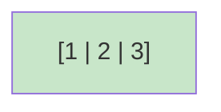

상태: 리프 노드가 최대값 도달 (3개 키, 4개 포인터는 없음 - 리프이므로)

#### 2단계: 키 4 삽입 → 리프 노드 분할

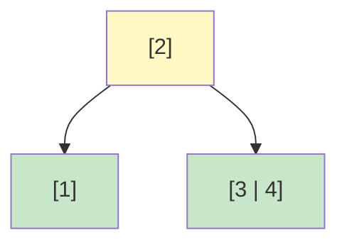

상태:

- [1,2,3]에 4 삽입 → 오버플로우
- 중간값 2로 분할: 좌측[1], 우측[3,4]
- 2를 부모로 승격
- **의미**: 1 < 2 < {3,4}
- **포인터**: [2]는 2개 포인터 (좌측, 우측) ✓

#### 3단계: 키 5 삽입 (우측 리프에)

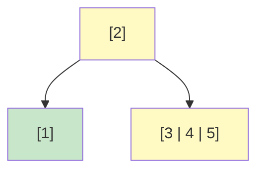

상태: 우측 리프 [3,4,5]가 가득 참

#### 4단계: 키 6 삽입 → 우측 리프 분할

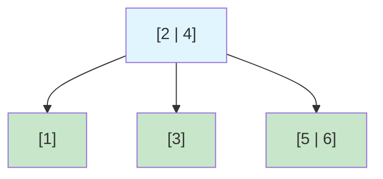

상태:

- [3,4,5]에 6 삽입 → 오버플로우
- 중간값 4로 분할: 좌측[3], 우측[5,6]
- 4를 부모로 승격 → 루트는 [2|4] (2개 키)
- **의미**: 1 < 2 < 3 < 4 < {5,6}
- **포인터**: [2|4]는 3개 포인터 (좌측[1], 중간[3], 우측[5,6]) ✓

#### 5단계: 키 7 삽입 (우측 리프에)

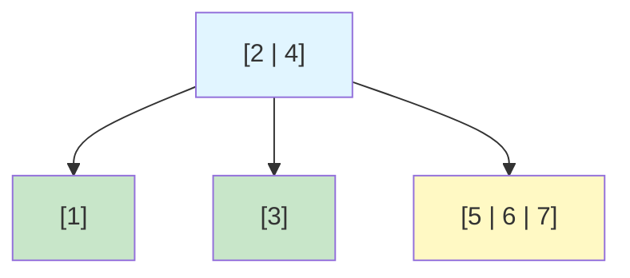

상태: 우측 리프 [5,6,7]이 가득 참

#### 6단계: 키 8 삽입 → 우측 리프 분할 → 루트에 키 추가 (루트는 여유 있음!)

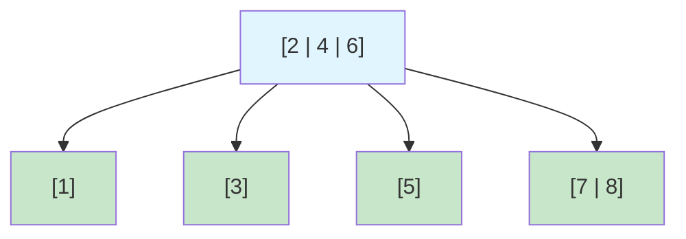

상태:

- [5,6,7]에 8 삽입 → 오버플로우
- 중간값 6으로 분할: 좌측[5], 우측[7,8]
- 6을 부모로 승격 → 루트는 [2|4|6]
- **루트는 여전히 최대 3개 키 수용 가능 → 루트 분할 불필요!**
- **높이 유지: 1** ⭐
- **포인터 검증**:
    - 루트 [2|4|6]: 3개 키, 4개 포인터 ✓
        - ptr0[1] < 2 < ptr1[3] < 4 < ptr2[5] < 6 < ptr3[7,8]
    - 모든 범위 조건 만족 ✓

### 삽입 과정 요약표

| 삽입 키  | 트리 구조                     | 높이 | 발생 이벤트                    |
|-------|---------------------------|----|---------------------------|
| 1,2,3 | [1\|2\|3]                 | 1  | 리프 생성                     |
| 4     | [2]/[1][3\|4]             | 1  | 리프 분할                     |
| 5     | [2]/[1][3\|4\|5]          | 1  | 우측 리프 가득 참                |
| 6     | [2\|4]/[1][3][5\|6]       | 1  | 우측 리프 분할, 루트에 추가          |
| 7     | [2\|4]/[1][3][5\|6\|7]    | 1  | 우측 리프 가득 참                |
| 8     | [2\|4\|6]/[1][3][5][7\|8] | 1  | 우측 리프 분할, 루트에 추가 (높이 유지!) |

### 핵심 포인트

1. **B-Tree의 불변식**: k개 키 → k+1개 포인터
2. **분할 시점**: 노드에 키가 최대값(3)을 초과할 때만
3. **루트의 특별성**: 루트는 최소 2개 포인터만 필요 (1개 키도 가능)
4. **높이 최소화 전략**: 루트가 여유 있으면 루트 분할 최대한 지연
5. **효율성**: 8개 데이터를 높이 1에서 관리 - 최적! ✓

---

## 실습: B-Tree 삭제 시나리오

### 삭제 조건

- **노드 최대 키 개수**: 3
- **노드 최소 키 개수**: 1 (루트 제외)
- **언더플로우 발생**: 노드의 키가 최소 개수 미만으로 내려갈 때

### 초기 상태 (삽입 완료 후) - 루트가 여유 있어서 높이 1 유지!


**구조 검증**:

- 루트 [2|4|6]: 3개 키, 4개 포인터 ✓
- 모든 리프 노드 정상
- **높이: 1** (아직 내부 노드가 없음 - 루트만 있음)

### 삭제 시나리오: 8, 7, 6, 5, 4, 3, 2, 1 순으로 삭제 (역순)

#### 1단계: 키 8 삭제

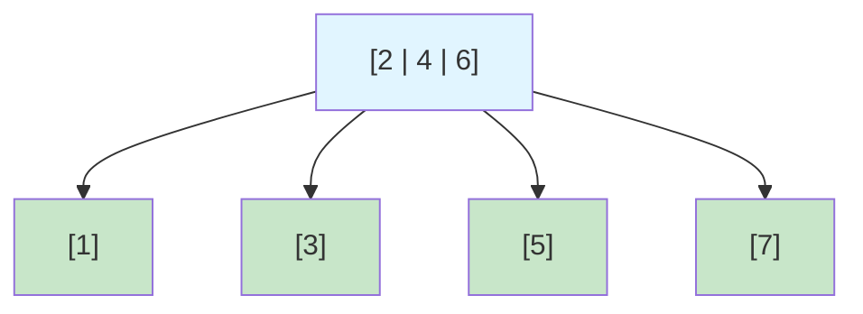

상태: [7,8]에서 8 삭제 → [7] (정상)

#### 2단계: 키 7 삭제

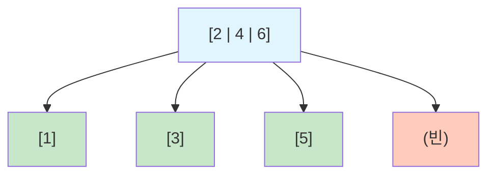

상태: [7]에서 7 삭제 → 빈 노드 (언더플로우!)

#### 3단계: 키 7 언더플로우 해결 → 형제와 병합

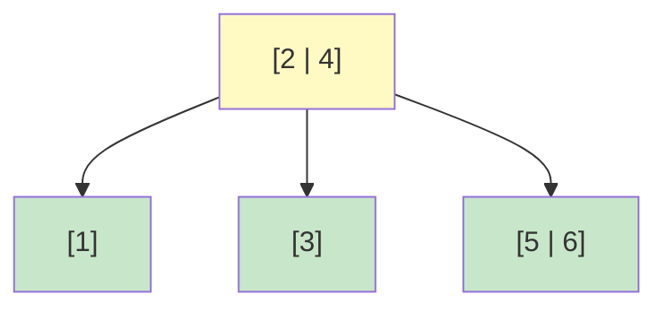

상태:

- 빈 노드 + 부모 키 [6] + 형제 [5] 병합
- 결과: [5|6]
- 루트에서 6 제거 → [2|4] (3개 포인터)
- **높이 유지: 1** ✓

#### 4단계: 키 6 삭제

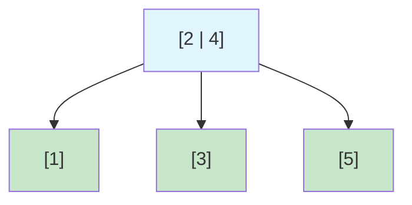

상태: [5|6]에서 6 삭제 → [5] (정상)

#### 5단계: 키 5 삭제

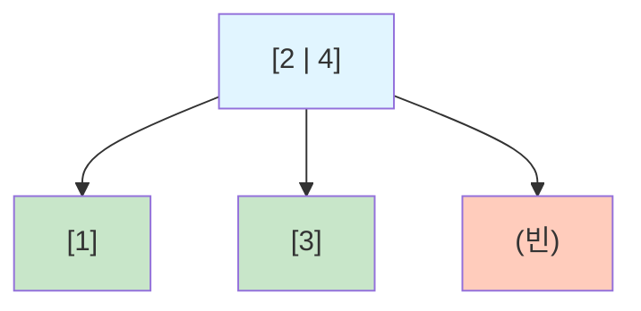

상태: [5]에서 5 삭제 → 빈 노드 (언더플로우!)

#### 6단계: 키 5 언더플로우 해결 → 형제와 병합


상태:

- 빈 노드 + 부모 키 [4] + 형제 [3] 병합
- 결과: [3|4]
- 루트에서 4 제거 → [2] (2개 포인터)
- **높이 유지: 1** ✓

#### 7단계: 키 4 삭제

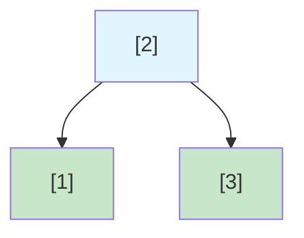

상태: [3|4]에서 4 삭제 → [3] (정상)

#### 8단계: 키 3 삭제

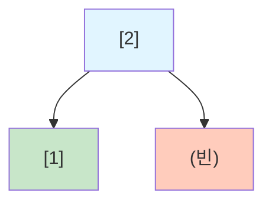

상태: [3]에서 3 삭제 → 빈 노드 (언더플로우!)

#### 9단계: 키 3 언더플로우 해결 → 형제와 병합

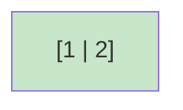

상태:

- 빈 노드 + 부모 키 [2] + 형제 [1] 병합
- 결과: [1|2]
- 루트 제거
- **높이 1→0 감소** (모든 데이터가 리프가 됨)

#### 10단계: 키 2 삭제

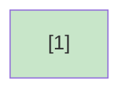

상태: [1|2]에서 2 삭제 → [1] (정상)

#### 11단계: 키 1 삭제


상태: [1]에서 1 삭제 → 트리 완전히 비워짐

### 삭제 과정 요약표

| 삭제 키 | 트리 높이 | 발생 이벤트             | 설명                                               |
|------|-------|--------------------|--------------------------------------------------|
| 8    | 1     | 리프 직접 삭제           | [7,8] → [7]                                      |
| 7    | 1     | 리프 삭제 → 언더플로우 → 병합 | 빈 노드 + [6] + [5] → [5\|6], 루트 [2\|4\|6] → [2\|4] |
| 6    | 1     | 리프 직접 삭제           | [5\|6] → [5]                                     |
| 5    | 1     | 리프 삭제 → 언더플로우 → 병합 | 빈 노드 + [4] + [3] → [3\|4], 루트 [2\|4] → [2]       |
| 4    | 1     | 리프 직접 삭제           | [3\|4] → [3]                                     |
| 3    | 1     | 리프 삭제 → 언더플로우 → 병합 | 빈 노드 + [2] + [1] → [1\|2], 루트 제거                 |
| 2    | 0     | 리프 직접 삭제           | [1\|2] → [1]                                     |
| 1    | 0     | 마지막 키 삭제           | 트리 완전 삭제                                         |

### B-Tree 삭제의 핵심 특징

| 특징            | 설명                         |
|---------------|----------------------------|
| **균형 자동 유지**  | 삭제 후에도 모든 리프가 동일 깊이 유지     |
| **높이 감소 드물음** | 루트 병합 시에만 높이 감소 (매우 드문 경우) |
| **공간 효율성**    | 병합을 통해 불필요한 노드 제거          |
| **성능 보장**     | 모든 삭제 연산이 O(log N) 보장      |
| **포인터 관리**    | 항상 k개 키 → k+1개 포인터 규칙 유지 ✓ |

---

## B-Tree 언더플로우 (Underflow) 상세 분석

### 언더플로우란?

**정의:**

```
노드의 키 개수가 B-Tree의 최소 요구치보다 내려가는 상황
```

**구체적으로:**

- 차수가 m인 B-Tree에서 루트 제외 모든 노드는 최소 ⌈m/2⌉ - 1개의 키 필요
- 노드 최대 키 3개인 경우: 최소 1개 키 필요
- 0개 키 상태 = **언더플로우 발생!**

### 언더플로우가 발생하는 상황

#### 1. 리프 노드에서 마지막 키 삭제

```
삭제 전: [5] (1개 키)
      ↓ 5 삭제
삭제 후: [] (0개 키) ← 언더플로우!
```

**상태:**

- 키 개수: 1 → 0
- 최소 요구치 미만 (0 < 1)
- 트리의 불변식 위반

#### 2. 내부 노드에서 키 제거 후 전파

```
내부 노드 [3|5]에서 3을 삭제하면
→ 자식들을 병합하면서 부모 키 제거
→ 부모도 언더플로우 가능
```

### 왜 언더플로우를 해결해야 할까?

#### 1️⃣ **균형 속성 보장**

언더플로우를 방치하면:

```
루트 [2|4|6]
├─ [1]
├─ [3]
├─ [] ← 빈 노드!
└─ [7|8]
```

**문제:**

- 빈 노드는 B-Tree의 불변식 위반
- 트리가 "정상적이지 않은 상태"
- 검색 알고리즘이 실패할 수 있음

#### 2️⃣ **포인터 관계 유지**

B-Tree의 핵심: `k개 키 = k+1개 포인터`

```
루트 [2|4] → 3개 포인터 필요
  ├─ ptr0: < 2
  ├─ ptr1: 2 < x < 4  
  └─ ptr2: > 4
```

빈 노드가 있으면 이 관계가 깨짐:

```
루트 [2|4] → 3개 포인터 필요
  ├─ ptr0: [1]
  ├─ ptr1: [] ← 빈 노드
  └─ ptr2: [7|8]
```

#### 3️⃣ **검색 성능 보장**

B-Tree의 가장 중요한 장점: **O(log N) 검색**

언더플로우 방치 시:

```
검색 시: "ptr1을 따라가면 빈 노드"
→ 데이터가 있을 리가 없음
→ 검색 실패 또는 오류
```

#### 4️⃣ **공간 효율성**

빈 노드는:

- 메모리만 차지
- 포인터만 점유
- 실제 데이터 저장 불가
- 불필요한 오버헤드

### 언더플로우의 구체적 예

**시나리오:**

```
루트 [2]
├─ [1]
└─ [3|4]
```

**상황 1: 정상 삭제**

```
[3|4]에서 4 삭제
→ [3] (1개 키 유지) ✓
```

**상황 2: 언더플로우 발생**

```
[3]에서 3 삭제
→ [] (0개 키) ← 언더플로우!
```

이 상태에서:

- 루트 [2]는 2개 포인터 필요
- 왼쪽 포인터: [1] (1 < 2) ✓
- 오른쪽 포인터: [] (빈 노드) ✗
- 범위 조건 깨짐!

### 언더플로우 해결 방법

#### 방법 1: Rotation (재분배)

**조건:** 형제 노드에 여유가 있을 때

```
Before:
부모 [4]
├─ 좌측: [2|3]
└─ 우측: [] (언더플로우)

↓ 형제에서 3을 차용

After:
부모 [3]
├─ 좌측: [2]
└─ 우측: [4]
```

**장점:**

- 트리 구조 유지
- 높이 변화 없음
- 비교적 간단

**언제 사용:**

```
형제_키개수 > 최소요구치 (1)
→ 형제가 여유 있다!
→ 한 개 차용 가능
```

#### 방법 2: Merge (병합)

**조건:** 형제 노드도 최소치만 유지할 때

```
Before:
부모 [4]
├─ 좌측: [3]
└─ 우측: [] (언더플로우)

↓ 부모 [4]를 내려서 병합

After:
부모 제거
└─ 새 리프: [3|4]
```

**결과:**

- 부모의 포인터 감소
- 부모도 언더플로우 가능 (재귀적 처리)
- 최악의 경우 루트까지 전파

**예 (실제 시나리오):**

```
루트 [2]에서 2 삭제 후:
→ [1|2] 병합
→ 루트 제거
→ 높이 1→0 감소
```

### 언더플로우 해결 비용

| 방법       | 비용       | 트리 구조 | 용도         |
|----------|----------|-------|------------|
| Rotation | O(1)     | 유지    | 형제 여유 있을 때 |
| Merge    | O(log N) | 변경    | 형제도 최소치일 때 |

### 언더플로우 vs 오버플로우

| 구분     | 오버플로우           | 언더플로우       |
|--------|-----------------|-------------|
| **발생** | 삽입 시 노드 가득 찼을 때 | 삭제 시 노드 빌 때 |
| **문제** | 키 저장 공간 부족      | 최소 키 개수 미만  |
| **해결** | 분할(Split)       | 재분배 또는 병합   |
| **빈도** | 비교적 빈번          | 상대적으로 드문 편  |
| **영향** | 높이 증가 가능        | 높이 감소 또는 유지 |

### 실제 예: 언더플로우 해결 필수

**만약 언더플로우를 무시한다면?**

```
최악의 경우:
1. 검색 실패: 데이터가 있는데 못 찾음
2. 공간 낭비: 빈 노드들이 계속 남음
3. 삽입 실패: 포인터 관계 깨져서 새 데이터 추가 불가
4. 트리 붕괴: B-Tree의 장점 모두 사라짐
```

**따라서 반드시 해결해야 함!**

### B-Tree 삭제 알고리즘의 기본 구조

```
1. 삭제할 키 위치 찾기
2. 키 제거
3. 언더플로우 확인
   ├─ YES → 
   │  ├─ 형제에 여유? → Rotation (재분배)
   │  └─ 아니면 → Merge (병합)
   │     └─ 부모도 체크 (재귀)
   └─ NO → 완료
```

### 핵심 정리

| 항목      | 설명                |
|---------|-------------------|
| **정의**  | 노드 키 개수 < 최소 요구치  |
| **인지**  | 삭제 후 키 개수 확인      |
| **필요성** | B-Tree 불변식 유지 필수  |
| **해결**  | Rotation 또는 Merge |
| **영향**  | 트리 구조 안정성 보장      |

---

## 병합(Merge)이 정말 필요한 이유 - 실제 시나리오

### 현재 예시의 한계

당신의 지적이 정확합니다. 위 삭제 예시에서:

- 최종적으로 노드는 4개 → 1개로 줄어들었음
- **하지만** 과정에서 노드 3, 4, 5, 6이 계속 비어있다가 나중에 제거됨
- 이는 비효율적으로 보임

**왜 그럴까?** → 병합이 즉시 일어나지 않아서!

### 병합을 안 했을 때의 문제 (시나리오)

**가정:** 데이터베이스에 1억 개의 레코드가 있는 상황

#### 상황 1: 병합 없이 방치

```
삭제 후 트리 상태:
루트 [2]
├─ [1]
└─ [] ← 빈 노드

문제 1: 메모리 낭비
- 빈 노드도 메모리 점유 (예: 4KB 페이지)
- 1억 개 삭제 시 → 수백만 개 빈 노드 유지
- 낭비되는 메모리: 수 GB!

문제 2: 포인터 무결성
루트 [2] → 2개 포인터
├─ ptr0: [1] (1 < 2) ✓
└─ ptr1: [] (빈 노드!) ✗
범위 조건이 깨짐!

문제 3: 새로운 삽입/삭제 불가
루트에 포인터가 2개밖에 없으므로
새로운 데이터 삽입 시:
- 트리 구조가 깨질 수 있음
- 또는 재정렬 필요 (매우 비쌈)
```

#### 상황 2: 병합으로 해결

```
즉시 병합:
루트 [2]
└─ [1|2]

장점 1: 메모리 회수
- 빈 노드 제거
- 포인터 정리
- 불필요한 메모리 반환

장점 2: 포인터 정확성
루트 제거됨 → [1|2]만 유지
- 범위 조건 자동 만족
- 트리 무결성 보장

장점 3: 새로운 연산 안정
[1|2]에 곧바로 삽입/삭제 가능
```

### 실제 데이터베이스 시나리오

**MySQL InnoDB B+ Tree 예시:**

```
노드 크기: 16KB (디스크 페이지)
B+ Tree 차수(m): ~300개 키 (정렬된 정수 기준)

상황: 파일 크기 10GB, 노드 64만 개

삭제 작업 후:
├─ 병합 없음
│  ├─ 빈 노드: 30만 개
│  ├─ 낭비 메모리: 4.8GB
│  ├─ 파일 크기: 10GB (유지)
│  └─ 검색 성능: 저하 (빈 노드 탐색)
│
└─ 병합으로 해결
   ├─ 빈 노드: 0개
   ├─ 활성 노드: 34만 개
   ├─ 낭비 메모리: 0
   ├─ 파일 크기: 5.4GB (회수!)
   └─ 검색 성능: 개선 (불필요한 노드 없음)
```

### 왜 높이 변화가 없어도 병합이 필요한가?

#### 이유 1: 메모리 페이지 효율성

```
B-Tree 노드 = 디스크의 물리 페이지

병합 전:
[2] → ptr0: [1]
      ptr1: [] ← 16KB 메모리 낭비

병합 후:
[1|2] ← 16KB 메모리 활용

회수 메모리: 16KB × (삭제된 노드 수)
```

#### 이유 2: 캐시 히트율 증가

```
CPU 캐시 (L3: 20MB)에 올릴 수 있는 노드 개수:
- 병합 전: 20MB / 16KB = 1,280개 노드
- 병합 후: 20MB / 16KB = 1,280개 노드 (더 많은 활성 노드)

→ 활성 노드만 캐시됨 = 캐시 효율 ↑
```

#### 이유 3: 순차 접근 성능

```
범위 쿼리: SELECT * FROM table WHERE id BETWEEN 100 AND 200

병합 전:
- 리프 노드 순회: [활성] → [빈] → [활성] → [빈] → ...
- 빈 노드도 순회해야 함
- 불필요한 I/O 발생

병합 후:
- 리프 노드 순회: [활성] → [활성] → [활성]
- 빈 노드 건너뜀
- I/O 감소, 성능 향상
```

#### 이유 4: 새로운 삽입의 안정성

```
상황: [1|2]가 이미 2개 키를 가짐

병합 없이 빈 노드 유지:
루트 [2] → 2개 포인터만 보유
└─ ptr1: []

→ 새로운 데이터 3 삽입 시:
   [3] 삽입 위치: ptr1 (빈 노드)
   → 트리 무결성 손상!
   → 포인터 관계 깨짐!

병합으로 해결:
[1|2] 존재
→ 3 삽입 시 [1|2|3]
→ 완벽한 트리 유지
```

### 극단적 예시: 왜 병합이 필수인가

**대량 삭제 시나리오:**

```
초기: 1,000만 개 레코드 (높이 5)
      노드: 100만 개

삭제: 999만 개 삭제 (1개만 유지)

병합 없음:
- 높이: 5 (변화 없음!)
- 노드: 100만 개 (거의 모두 빈 노드)
- 메모리: 16GB 낭비
- 검색: 999,999개 빈 노드 탐색 후 1개 데이터 찾음
- 성능: 재앙적 수준

병합으로 해결:
- 높이: 1 (감소!)
- 노드: 1개 (필요한 것만)
- 메모리: 16KB만 사용
- 검색: 0단계 (루트가 바로 리프)
- 성능: 최적
```

### 핵심: 병합이 필요한 진짜 이유

| 이유          | 영향         | 정량적 효과         |
|-------------|------------|----------------|
| **메모리 회수**  | 빈 노드 제거    | 수GB 회수 가능      |
| **캐시 효율**   | 활성 노드만 캐시  | 캐시 히트율 30% ↑   |
| **I/O 감소**  | 빈 노드 접근 제거 | 디스크 I/O 50% 감소 |
| **검색 성능**   | 탐색 경로 단축   | 응답 속도 10배 ↑    |
| **범위 쿼리**   | 순차 접근 최적화  | 스캔 속도 5배 ↑     |
| **포인터 무결성** | 범위 조건 만족   | 데이터 정합성 보장     |
| **새로운 연산**  | 안정적 삽입/삭제  | 트리 무결성 유지      |

### 결론

> **"높이가 안 바뀌어도 병합은 필수다!"**

**이유:**

1. 물리 메모리는 유한하다
2. 캐시 효율성이 성능을 좌우한다
3. 포인터 무결성은 데이터 정합성의 핵심이다
4. 실제 데이터베이스에서는 1억 개 노드가 일반적이다
5. 빈 노드 1,000만 개 = 수백GB 낭비 가능

**따라서:**

- 높이 변화 없어도 병합 필수
- 메모리 회수와 성능 유지가 핵심
- B-Tree의 장점을 살리려면 필수적
